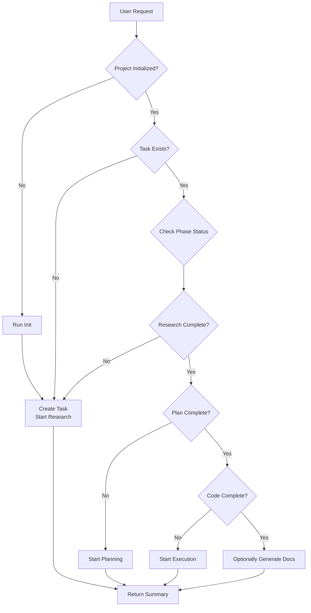

# Using RRCE with OpenCode

This guide explains how to use the RRCE workflow orchestrator with OpenCode to build features systematically through research, planning, and execution.

## Table of Contents

- [Overview](#overview)
- [Installation](#installation)
- [Agent Architecture](#agent-architecture)
- [Using the RRCE Orchestrator](#using-the-rrce-orchestrator)
- [Workflow Phases](#workflow-phases)
- [Common Workflows](#common-workflows)
- [Advanced Usage](#advanced-usage)
- [Troubleshooting](#troubleshooting)

---

## Overview

RRCE (Research-Research-Code-Execute) workflow integrates with OpenCode as:
1. **MCP Server**: Provides project knowledge and semantic search
2. **Primary Agent** (`rrce`): Orchestrates the complete workflow lifecycle
3. **Subagents**: Specialized agents for each phase (init, research, planning, execution, documentation)

### Why RRCE?

Traditional AI coding assistants jump straight to implementation. RRCE enforces a systematic approach:
1. **Research** requirements and clarify intent
2. **Plan** the implementation with acceptance criteria
3. **Execute** the code changes following the plan
4. **Document** what was built

This reduces hallucinations, improves code quality, and maintains project context.

---

## Installation

### Prerequisites

- Node.js 18+ installed
- OpenCode installed (`npm install -g opencode`)

### Quick Start

```bash
# Run the RRCE setup wizard
npx rrce-workflow

# When prompted:
# 1. Choose your storage mode (Global recommended for OpenCode)
# 2. Select "OpenCode" as a tool
# 3. Complete setup

# Restart OpenCode
opencode
```

### Verify Installation

Check `~/.config/opencode/opencode.json`:

```json
{
  "$schema": "https://opencode.ai/config.json",
  "mcp": {
    "rrce": {
      "type": "local",
      "command": ["npx", "-y", "rrce-workflow", "mcp", "start"],
      "enabled": true
    }
  },
  "agent": {
    "rrce_orchestrator": {
      "description": "Orchestrates RRCE workflow lifecycle...",
      "mode": "primary",
      "prompt": "{file:./prompts/rrce-orchestrator.md}",
      "tools": { ... }
    },
    "plan": {
      "disable": true  // OpenCode's plan agent is hidden
    }
  }
}
```

---

## Agent Architecture

### Primary Agent: RRCE Orchestrator

**Agent Name**: `rrce`  
**Mode**: Primary (tab-switchable)  
**Purpose**: Coordinate the full workflow

**When to Use:**
- Starting a new feature or task
- Want systematic research → planning → execution
- Need to check task status
- Building something complex that needs structure

**Access**: Press `Tab` to cycle to RRCE agent

### Subagents (Expert Mode)

These run automatically via the orchestrator, but you can invoke them directly:

| Agent | Invoke With | Purpose |
|-------|-------------|---------|
| **Init** | `@rrce_init` | Create project context & semantic index |
| **Research** | `@rrce_research_discussion` | Clarify requirements, ask questions |
| **Planning** | `@rrce_planning_discussion` | Break work into tasks with acceptance criteria |
| **Executor** | `@rrce_executor` | Write code following the plan |
| **Documentation** | `@rrce_documentation` | Generate docs for completed work |
| **Doctor** | `@rrce_doctor` | Analyze codebase health |
| **Sync** | `@rrce_sync` | Update project context |

---

## Using the RRCE Orchestrator

### Method 1: Direct Usage (Switch to RRCE Agent)

```
1. Press Tab to switch to RRCE agent
2. Type your request:
   "I need to add user authentication with JWT tokens"
3. RRCE will:
   ✓ Check if project is initialized
   ✓ Start research phase
   ✓ Ask clarifying questions
   ✓ Generate research brief
   ✓ Ask if you want to proceed to planning
   ✓ Create execution plan
   ✓ Ask if you want to execute
   ✓ Implement the code
```

### Method 2: Build Agent Delegation (Automatic)

```
1. Stay in Build agent (default)
2. Ask: "Help me implement feature X"
3. Build will automatically delegate to RRCE
4. RRCE orchestrates the workflow
5. Results flow back to Build
6. Build continues with context
```

### What the Orchestrator Does



---

## Workflow Phases

### Phase 1: Init (First Time Only)

**Purpose**: Analyze your codebase and create project context

**When**: 
- New project
- First time using RRCE
- Major architecture changes

**Output**: 
- `knowledge/project-context.md` - Tech stack, patterns, conventions
- Semantic search index for fast knowledge retrieval

**Example**:
```
You: @rrce_init
RRCE Init: Analyzing codebase...
          Found: TypeScript, React, Express
          Conventions: ESLint, Prettier
          Testing: Vitest
          ✓ Project context saved
          ✓ Semantic index built (342 files)
```

### Phase 2: Research

**Purpose**: Clarify requirements before coding

**When**: Starting any new feature or task

**Output**: `tasks/{slug}/research/{slug}-research.md`

**What It Does**:
1. Asks clarifying questions
2. Exposes assumptions and edge cases
3. Searches existing knowledge
4. Documents requirements and acceptance criteria

**Example**:
```
You: I need to add authentication
RRCE: Starting research phase...

Questions:
1. What type of auth? (JWT, OAuth, Session-based)
2. What's the user model? (email/password, social login)
3. Password requirements? (complexity, reset flow)

[Interactive Q&A follows]

✓ Research complete
  Artifact: tasks/user-auth/research/user-auth-research.md
  
Ready to proceed to planning?
```

### Phase 3: Planning

**Purpose**: Break requirements into executable tasks

**Requires**: Research complete

**Output**: `tasks/{slug}/planning/{slug}-plan.md`

**What It Does**:
1. Proposes task breakdown
2. Defines acceptance criteria per task
3. Maps dependencies
4. Estimates effort

**Example**:
```
RRCE: Planning user-auth implementation...

Proposed Tasks:
1. Create User model & migration (M) - No dependencies
2. Implement JWT service (S) - Requires Task 1
3. Add auth middleware (M) - Requires Task 2
4. Create login/register endpoints (L) - Requires Task 2,3
5. Write integration tests (M) - Requires Task 4

Validation Strategy:
- Unit tests for JWT service
- Integration tests for auth flow
- Manual: Try login with valid/invalid credentials

Looks good? Any tasks to split or merge?
```

### Phase 4: Execution

**Purpose**: Implement the code following the plan

**Requires**: Planning complete

**Output**: Code changes + `tasks/{slug}/execution/{slug}-execution.md`

**What It Does**:
1. Executes tasks in order
2. Runs validation after each task
3. Documents what was built
4. Captures test results

**Example**:
```
RRCE: Starting execution for user-auth...

Task 1/5: Create User model & migration
  ✓ Created src/models/User.ts
  ✓ Created migrations/001_create_users.sql
  ✓ Tests pass (3/3)

Task 2/5: Implement JWT service
  ✓ Created src/services/jwt.ts
  ✓ Added tests
  ✓ Tests pass (5/5)

[Continues through all tasks...]

Execution complete!
Files changed: 8 files (+342 lines)
Tests: 18/18 passing
```

### Phase 5: Documentation (Optional)

**Purpose**: Document what was built

**Requires**: Execution complete

**Output**: `tasks/{slug}/docs/{slug}-docs.md`

**What It Does**:
1. Generates API documentation
2. Updates README if needed
3. Creates usage examples

---

## Common Workflows

### Workflow 1: New Feature End-to-End

```
# Switch to RRCE agent
Tab → RRCE

# Request
"Add rate limiting to the API"

# RRCE will guide you through:
Research  → "Which endpoints? What limits? Per user or global?"
Planning  → "3 tasks: middleware, config, tests"
Execution → "Implementing... all tests pass ✓"

# Result: Feature fully implemented with docs
```

### Workflow 2: Build Agent Auto-Delegation

```
# Stay in Build agent
Build

# Request
"I need to add caching"

# Behind the scenes:
Build: "This needs structured workflow..."
      → Delegates to RRCE
RRCE: → Runs research
      → Creates plan
      → Executes code
      → Returns summary to Build
Build: "Done! I've added Redis caching with these configurations..."
```

### Workflow 3: Check Task Status

```
# Switch to RRCE
Tab → RRCE

# Ask
"What's the status of user-auth?"

# Response
Task: user-auth
✓ Research: Complete (2 days ago)
✓ Planning: Complete (1 day ago)
⏳ Execution: In progress (started 2 hours ago)
  - Tasks: 3/5 complete
  - Next: Implement auth middleware
❌ Documentation: Not started
```

### Workflow 4: Resume Interrupted Work

```
# You left off mid-execution yesterday
RRCE

"Continue the user-auth task"

# RRCE checks state:
"I see user-auth is 60% complete (3/5 tasks done).
 Resuming with Task 4: Create login endpoints..."
```

### Workflow 5: Expert Mode (Direct Subagent)

```
# When you know exactly what phase you need
@rrce_executor TASK_SLUG=user-auth

# Skips orchestration, goes straight to execution
# (Requires plan to exist)
```

---

## Advanced Usage

### Custom Task Creation

```
RRCE

"Create a task called 'optimize-queries' for improving database performance"

# RRCE creates task structure:
tasks/
  optimize-queries/
    meta.json          # Task metadata
    research/          # Will be populated
    planning/          # Will be populated
    execution/         # Will be populated
```

### Parallel Task Execution

```
# Start multiple research phases in parallel
@rrce_research_discussion TASK_SLUG=feature-a REQUEST="..."
@rrce_research_discussion TASK_SLUG=feature-b REQUEST="..."

# Then use orchestrator to manage execution order
```

### Knowledge Search Integration

RRCE automatically searches your project knowledge:

```
RRCE: "I found existing auth patterns in your codebase:
       - OAuth integration in src/auth/oauth.ts
       - Session management in src/middleware/session.ts
       
       Should we follow these patterns or implement something new?"
```

### MCP Tool Access

RRCE orchestrator has access to all MCP tools:

```typescript
// These work automatically:
rrce_search_knowledge("authentication patterns")
rrce_get_project_context()
rrce_list_tasks()
rrce_get_task("user-auth")
rrce_search_code("JWT implementation")
```

---

## Troubleshooting

### "RRCE agent not showing when I press Tab"

**Check**:
```bash
cat ~/.config/opencode/opencode.json | grep rrce_orchestrator
```

**Fix**:
```bash
npx rrce-workflow  # Re-run setup
```

### "Build agent still hallucinating agents"

**Possible causes**:
1. Old OpenCode config cached
2. RRCE orchestrator not in primary mode

**Fix**:
```bash
# Restart OpenCode completely
pkill opencode
opencode

# Verify in config:
# agent.rrce_orchestrator.mode should be "primary"
```

### "Can't find project-context.md"

**Solution**: Run Init first:
```
@rrce_init
```

### "Planning says 'Research not found'"

**Issue**: You skipped research phase

**Solution**: Complete research first:
```
RRCE → "I need feature X"
# Let it run research before planning
```

### "Execution fails with 'Plan not found'"

**Issue**: Skipped planning

**Solution**: Run planning phase:
```
@rrce_planning_discussion TASK_SLUG=your-task
```

### "Subagent output not reflected in build"

**Old behavior** (before orchestrator): This was the bug!

**New behavior**: Use RRCE orchestrator (primary agent), not direct subagent invocation. The orchestrator properly returns results to build.

---

## Best Practices

### 1. Always Initialize First
```
New project? Run @rrce_init before anything else
```

### 2. Don't Skip Phases
```
✓ Research → Planning → Execution
✗ Jump straight to Execution
```

### 3. Use Orchestrator for Workflows
```
✓ Switch to RRCE agent for full features
✗ Manually invoke each subagent
```

### 4. Let Build Delegate
```
✓ Ask build for help, let it delegate to RRCE
✓ Build stays in control but uses RRCE's structure
```

### 5. Check Status Regularly
```
"What's the status of {task}?"
# Keeps you informed of progress
```

### 6. Review Artifacts
```
# After each phase, read the artifact:
tasks/{slug}/research/{slug}-research.md
tasks/{slug}/planning/{slug}-plan.md
tasks/{slug}/execution/{slug}-execution.md
```

---

## Keybindings

| Key | Action |
|-----|--------|
| `Tab` | Cycle to next primary agent (build → **rrce** → general → explore) |
| `Shift+Tab` | Cycle to previous primary agent |
| `Ctrl+X, A` | List all agents (including subagents) |

---

## File Structure

After using RRCE, your workspace will have:

```
.rrce-workflow/              # RRCE data (global or local)
├── knowledge/
│   ├── project-context.md   # Generated by Init
│   └── embeddings.json      # Semantic search index
├── tasks/
│   └── {task-slug}/
│       ├── meta.json        # Task metadata & status
│       ├── research/
│       │   └── {slug}-research.md
│       ├── planning/
│       │   └── {slug}-plan.md
│       └── execution/
│           └── {slug}-execution.md
└── config.yaml              # RRCE configuration

~/.config/opencode/
├── opencode.json            # OpenCode config (agents + MCP)
└── prompts/
    ├── rrce-orchestrator.md # Primary orchestrator
    ├── rrce-init.md        # Subagent prompts
    ├── rrce-research.md
    └── ...
```

---

## FAQ

**Q: Do I have to use RRCE for everything?**  
A: No! Use build/general for quick tasks. Use RRCE for complex features.

**Q: Can I skip research/planning?**  
A: Technically yes (direct subagent), but not recommended. The workflow exists to prevent bugs.

**Q: What if I disagree with the plan?**  
A: Tell RRCE! The planning agent will revise based on your feedback.

**Q: Can I use RRCE with other agents?**  
A: Yes! Build can delegate to RRCE. You can switch between agents freely.

**Q: Does this replace OpenCode's plan agent?**  
A: Yes. RRCE's planning is more comprehensive. OpenCode's plan is auto-disabled.

**Q: What's the difference between RRCE primary vs subagents?**  
A: Primary (`rrce`) orchestrates workflows. Subagents (`@rrce_*`) are specialists you can invoke directly.

---

## Support

- **Issues**: https://github.com/rryando/rrce-workflow/issues
- **Docs**: https://github.com/rryando/rrce-workflow/tree/main/docs
- **MCP Spec**: https://spec.modelcontextprotocol.io

---

**Happy building with structured workflows!** 🚀
